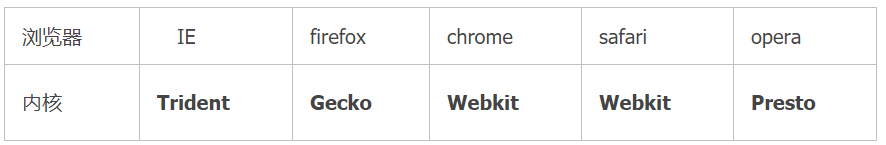

# collect-file
一些学习笔记,前期总结无法找到出处，后期总结会添加出处，提倡原创 尊重版权。
最后 感谢各位大佬的贡献！

## .md文件常规操作 （以下点击编辑查看）
- 大标题:'## *****' 
- 换行 '- *****'
- 使用图片 ''
例如：

- 使用连接 ' [说明文字***](地址)' 
例如：[推荐阅读](https://juejin.im/post/5c9ad3ecf265da61173a43ab)
