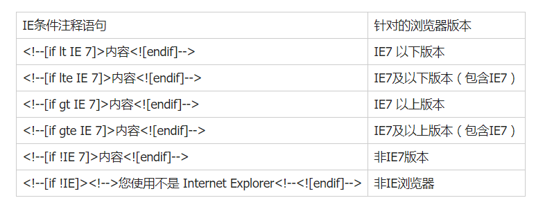

#css之兼容性
## 各浏览器引擎

##  针对IE浏览器样式写法
- <!-- [if IE]>
-   		//你想要执行的代码
- <![endif]-->

## IE6不支持子选择器
 可写专门的样式并注释 .content {color:red;}
## IE 不支持透明 不能使用24为的png图片
- 解决方案：
  - 1、使用8位的png图片
  - 2、为IE6准备一套特殊的图片
## 透明度  
  - opacity: 0.8; //通用
  - filter: alpha(opacity=80); //IE
  - filter:progid:DXImageTransform.Microsoft.Alpha(style=0,opacity=80); //IE6的写法
## IE6双边距
 - 行内属性设置了块级属性（display: block;）后，会产生双倍边距。
 - 解决方案是在添加一个 display: inline; 或者 display: table;
 
 ## 浏览器厂商前缀
 - -webkit-transform: translateX(x)  //Safari and Chrome
 - -o-transform:  translateX(x)        //Opera
 - -moz-transform: translateX(x)    //Firefox
 -  -ms-transform:   translateX(x)   //IE

 